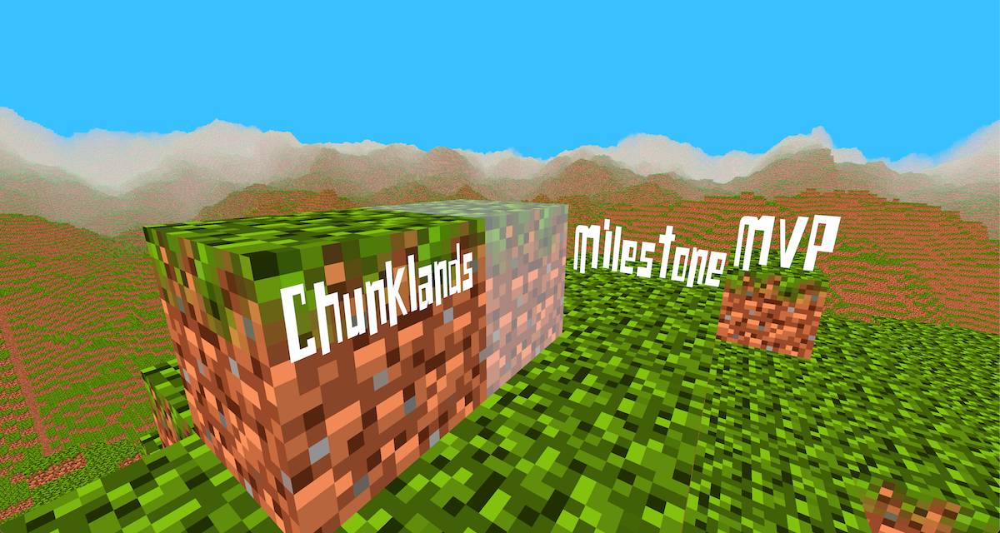
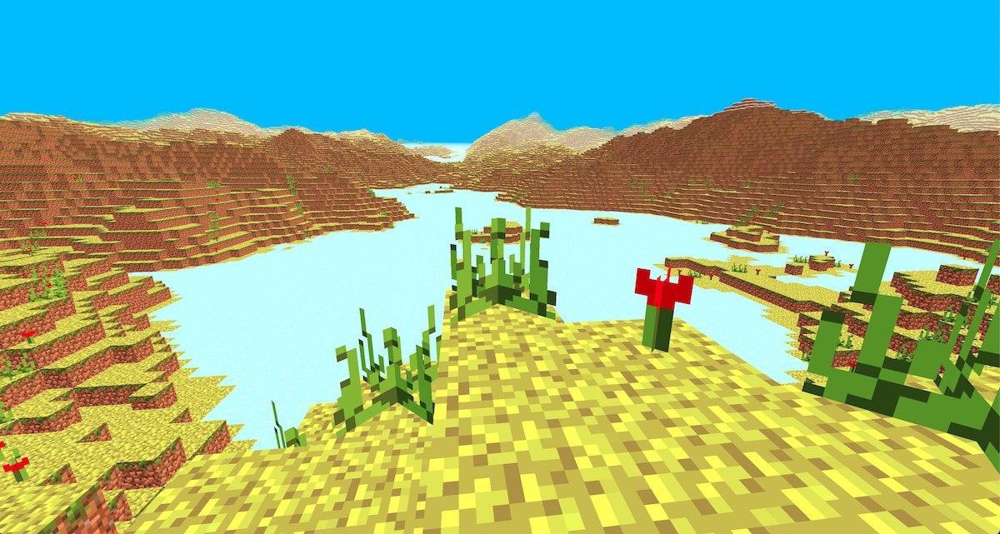
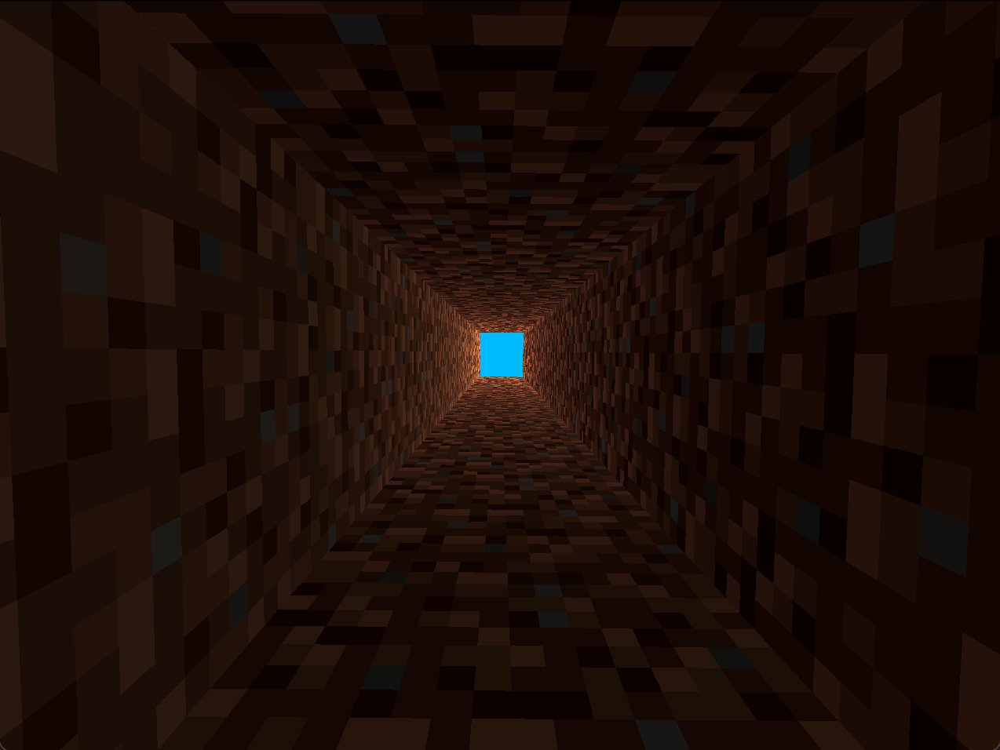
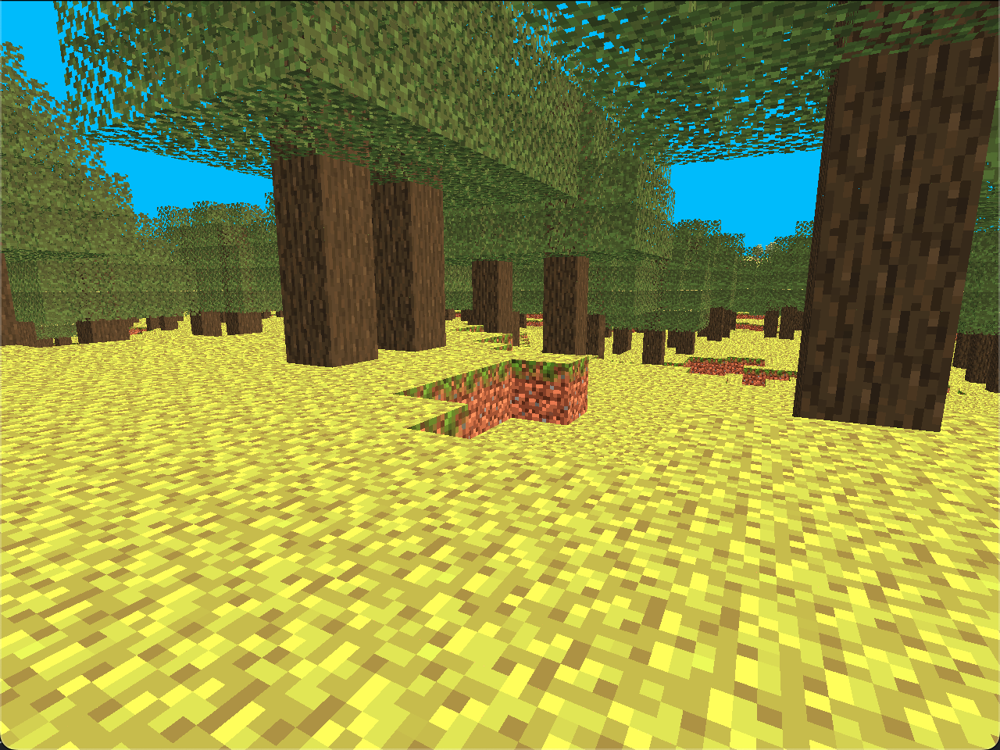

# Chunklands

Chunklands is a video game with a voxel-based, procedural generated infinite 3D sandbox and open world.

Constructing, mining, resource processing and management, exploration and role-play gaming (RPG) should be the main characteristics of Chunklands.

Technical focus is that minimum hardware requirements stay low. For Windows, Linux and MacOS.

## News and community

- [Visit the website](https://chunklands.de)
- [Read the blog](https://chunklands.de/blog/README.md)
- [Follow on Twitter](https://twitter.com/chunklands)
<!-- - [Chat on Discord](https://discord.gg/pdHsD82D) -->

## Content

### Story start

You wake up in the middle of nowhere, having nothing on you. Where are all? Where are you? Seems like everything looks familiar, but things are different.

Sun sets and the environment is getting more and more alien. You understand that a shelter is needed and you're very hungry.

It's not planet earth!

### Story end

Chunklands has a set of missions. All missions completed is as well temporarily the end of the game. Game updates will ship further missions over time. Missions can be played with no specific order, but it makes sense to complete them in order to gain skills continually.

Technological- and RPG-skill progress is beneficial for missions. The players decide which way they go. Missions are not essential for playing Chunklands at all, so skipping them and build a large automated mining system is also possible.

### Game characteristics

Chunklands has those characteristics focussed:

- **Constructing, mining, resource processing and management**
  - *Infinite 3D world*: Horizontal walking in any direction as far as the feet can carry. Digging down as far as the pick allows us. Or flying up to the sky.
  - *Recipes*: Easy and complex combinations of objects create new objects. Recipes have to be explored.
  - *Multiblocks and blueprint system*: Blocks can be grouped. Blueprints can simplify building.
- **Exploration and RPG**
  - *Open story-telling*: Chunklands consists of many different small and big story parts as missions which altogether shapes the game story. Missions can be skipped, but perhaps useful skills, items or recipes are missed.
  - *Vitals*: Every player needs to drink, eat, breath air and maintains a body temperature to function properly. Ignoring them may lead to serious damage.
  - *Modifiers and skills*: By default tools do their job, but they can be modified to become better, as well as the player can practise to gain skills.

### Game components

- **World and objects**
  - *Blocks, items and recipes*: Blocks can be placed into the world. Items can be hand-held or used for crafting. Recipes have to be explored, before using them. They allow crafting blocks and items.
  - *Diversity of biomes, blocks and items*: Although there is a finite set of biome types, blocks and items, they may carry different meta data, which makes each and every object unique and different.
  - *Metric system*: Objects like machines or conveyors can emit metrics that can be used for further process automation or monitoring. Metrics can be triggers and values that can be combined to compose complex automation circuits to control machines, and for example save power or notify the players when some condition is met.
- **HUD and menu**
  - *Map*: One of the essential game tools is the world map. The world is very big and it's impossible to memorize each and every point of interest, so for example markers will help.
  - *Inventory and hotbar*: Every player has an inventory with a fixed amount of slots where to put objects. During the game it's possible get upgrades for them. While playing there is a hotbar at the bottom which can be filled with objects that are often needed.
- **Gameplay**
  - *Riddles*: The world is full of mysteries waiting to be solved. It can be small clues or large complex structures with traps, enemies and a treasure.
  - *Game points*: All players get game points for different achievements which can be used to unlock skills, technologies or recipes.
  - *NPCs*: Players will meet several non-player characters (NPC), like villagers and hikers for trading goods or asking for help.

## Game aesthetics

- Video
  - Look and feel of the world
    - More dirty than clean
    - Post-apocalyptic, steam-punk elements
    - Contrary biome types: hot and cold, wet and dry, flat and high, etc.
  - Low-end focus
    - More important to support reducing visuals and effects to a necessary minimum via video settings
    - High-end effects have low priority
- Audio
  - Audio engine that gives a very natural feeling about the environment
    - realistic 3D reverb and echo
    - environment composition filtering
  - Background music
    - Chilling vibes that fit to the scenery
    - smooth transitions

## Team

*Well, it's currently just me.* 🤷‍♂️

Philipp Renoth aka `DaAitch`, find me here:

- [Twitter](https://twitter.com/daaitch)
- [GitHub](https://github.com/daaitch)

## Development

Main technologies are Rust 🦀, Vulkan 🌋.

### Mod system

There are plans to create a WASM (WebAssembly) API for mods.

### Experimental ideas

- Realistic reverberation: Using a graphics ray-tracer for lazily generating the reverb response for a dirac impulse for rooms and do reverb interpolation